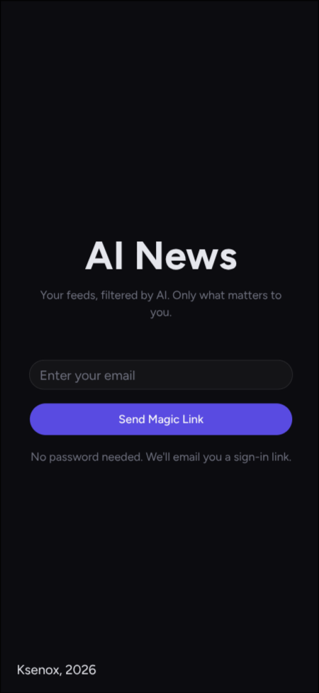
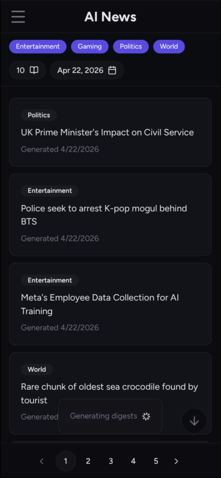
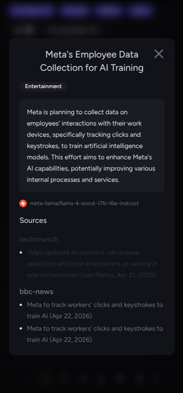
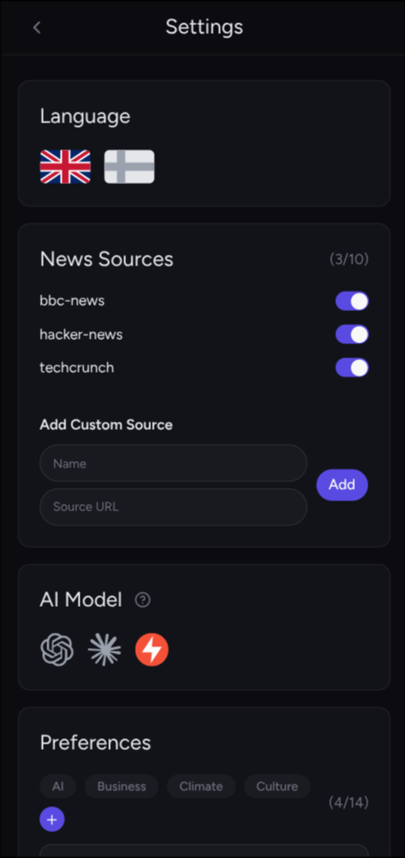

# AI News Aggregator

A personalized news aggregation app powered by LLMs. It pulls articles from your configured RSS/Atom sources, classifies them by topic using an AI agent, and groups them into living digests that evolve as new articles arrive — giving you a concise, always-current briefing instead of a raw churn of links.

## User Journey

### Login

Passwordless magic-link authentication. Enter your email and a sign-in link is delivered via Resend. No password ever stored.

### Feed

The main view. Digests are displayed as cards - each one a distilled summary of a topic cluster spanning one or more articles. Cards show the digest title, categories and latest revision date. Click any card to open the detail modal.

Use the toolbar to narrow what you see:

- **Category chips** — toggle one or more topic tags to filter the feed
- **Page size picker** — show 10, 20, or 50 digests per page
- **Date picker** — jump to a specific day's digests (up to 30 days back)

### Digest Detail (modal)

Opens inline as a modal over the feed. Shows the full digest text, categories, the AI agent that generated it, and a source map — the list of articles that contributed to this revision. Each source article links out to the original in a new tab.

Navigating directly to `/digests/[id]` renders the same content as a standalone full page (e.g. from a shared link or browser history).

### Generating the Feed

Generation starts automatically on every visit to the feed page. The pipeline streams results back in real time:

1. **Fetch** — retrieves articles from all your enabled sources using ETags to skip unchanged feeds
2. **Classify** — AI agent tags each new article with matching categories
3. **Route** — decides which existing digest each article belongs to, or flags it as a new topic
4. **Generate** — writes or updates digest summaries, streaming each result as it completes

Progress and any errors surface as toast notifications while generation runs.

## Settings

### Sources

Add up to 10 RSS/Atom feed URLs. Each source gets a slug for display and can be toggled on/off without deletion. Removing a source stops future fetches but leaves existing cached articles intact.

### AI Model

Configure which LLM does the work. Supported providers: **Anthropic** (Claude), **OpenAI** (GPT / o-series), **Groq** (free, no API key required). Your API key is encrypted at rest using `CRYPTO_SECRET` before being stored in the database — it is never stored in plaintext.

> **Demo note:** Groq uses a shared API key across all demo users. It may be slow or rate-limited under concurrent load.

### Preferences

Select which topic categories you care about. The feed pipeline only classifies and routes articles into your enabled categories, keeping digests focused.

---

## Tech Stack

**Framework:** Next.js 16 (App Router), React 19, TypeScript 5
**API:** tRPC 11 — HTTP batch for queries/mutations, SSE subscription for streaming generation
**Database:** MySQL · Kysely (query builder + codegen for type-safe table interfaces)
**Auth:** better-auth · magic-link plugin · Resend (email delivery)
**AI:** Anthropic SDK · OpenAI SDK — adapter pattern for provider-agnostic pipeline
**UI:** shadcn/ui · Radix UI · Tailwind CSS 4 · next-intl (EN / FI)
**Security:** libsodium-wrappers-sumo (Argon2id KDF + AES-256-GCM) — API keys encrypted before storage

**Hosting:** Vercel · MySQL (AWS)
